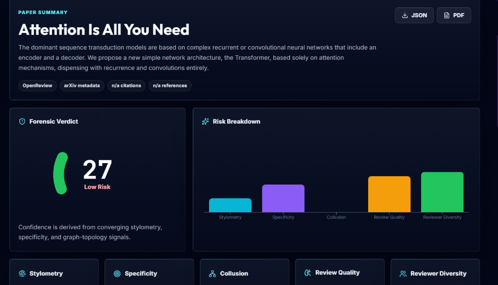
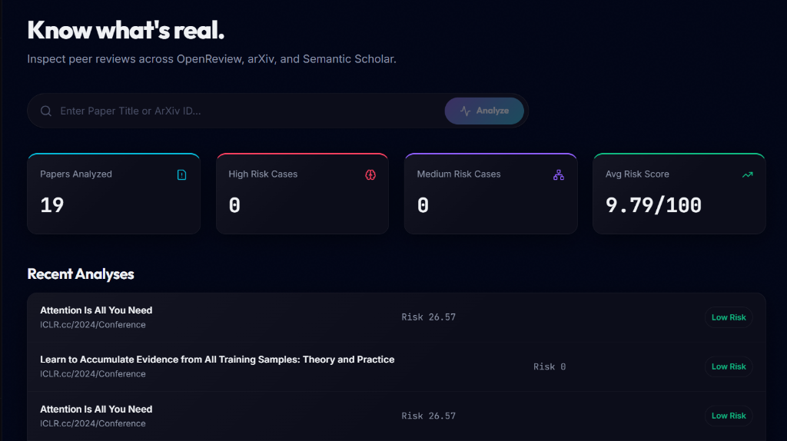
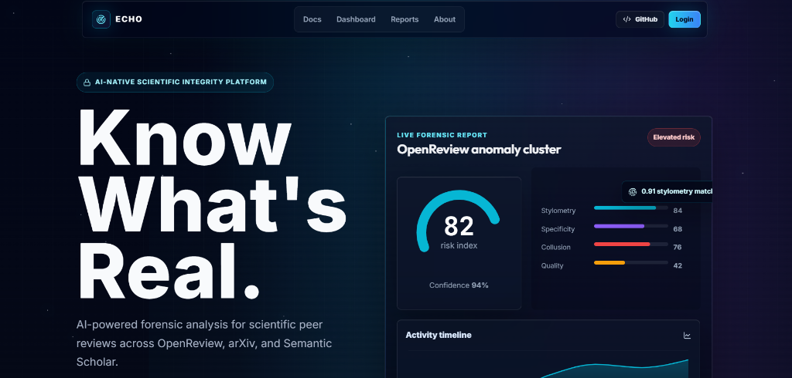

<div align="center">
  <h1>ECHO</h1>
  <h3>Know What's Real.</h3>
  <p>
    Detects suspicious peer-review behavior—like generic reviews, low-specificity feedback, text similarity, and collusion patterns—across OpenReview, arXiv, and Semantic Scholar.
  </p>
</div>

---

## Screenshots







---

## Project Context

Scientific peer review is a critical trust system, but scaling it has introduced issues. As submission volumes climb and AI-generated reviews become cheaper, spot-checking manually doesn't scale. 

ECHO exposes these anomalies. It pulls paper metadata and review text, analyzes them, and flags patterns that warrant a closer look. The objective is to make coordination and low-effort reviews visible so human chairs can make informed decisions.

---

## Targeted Anomalies

ECHO detects four main classes of risk:

* **Low-Specificity & Generic Text**: Reviews relying on broad academic filler language with low vocabulary entropy or weak domain density.
* **Stylometry Similarity**: Reviews whose text is suspiciously close to the paper's own abstract or content.
* **Collusion Patterns**: Reviewer-paper-author graphs with tight cycles suggesting coordinated rings.
* **Behavioral Anomalies**: Burst timing patterns, repeated template phrases, or unusually weak reviewer diversity.

---

## Frontend Interface

The UI is a dark-mode dashboard inspired by modern developer platforms, giving clear access to forensics without clutter:

* **Interactive Landing & Search**: A modern entryway featuring an active search bar and real-time thinking state animations.
* **Forensic Command Dashboard**: Displays the overall verdict gauge, timeline charts, and actionable risk cards.
* **Visual Graph Map & Reports**: Renders an interactive D3 collusion graph, detailed findings, and export options (PDF and JSON).
* **Live Status Monitoring**: A dedicated source-health page showing real-time connectivity states of downstream academic APIs.

---

## Analysis Engines

### Stylometry
We compare the abstract with review text using cosine similarity to detect templated or model-coordinated writing.
It loads a local HuggingFace `all-MiniLM-L6-v2` transformer by default. If HuggingFace is blocked or offline, it falls back to a local lexical similarity engine so analyses never fail.

### Specificity
Estimates how technical a review is by checking:
* Vocabulary entropy.
* Domain-specific vocabulary density.
* Usage frequency of academic filler phrases.

This flags reviews that use broad praise without actual technical depth.

### Collusion
Constructs a directed graph of papers, authors, and reviewers, running NetworkX under the hood to find tight co-review cycles.
*Feature:* If live API data is sparse for a searched paper, the engine injects a seeded fallback dataset to ensure the interactive D3 graph is fully populated for immediate visual inspection during demos.

### APIs & Data Sources
Queries live data from open academic APIs:
* **OpenReview**: Fetches submissions and review text.
* **arXiv**: Gathers preprint metadata.
* **Semantic Scholar**: Resolves citation and graph relationships.

---

## Repository Structure

```text
ECHO
├── backend
│   ├── FastAPI API
│   ├── OpenReview, arXiv, Semantic Scholar fetchers
│   ├── Stylometry analyzer
│   ├── Specificity analyzer
│   ├── Collusion graph analyzer
│   ├── Offline-safe embedding fallback
│   └── SQLite persistence with graceful failure handling
│
└── frontend
    ├── Next.js App Router
    ├── React 19.2.4
    ├── Tailwind CSS
    ├── Framer Motion
    ├── Recharts
    ├── D3 collusion graph
    ├── shadcn-style reusable button primitive
    └── Premium glassmorphic SaaS UI
```

---

## Tech Stack

Frontend:
* **Core Framework**: Next.js 15 (App Router) & React 19.2.4.
* **Styling**: Tailwind CSS v4.
* **Data Visualization**: Recharts & D3.
* **Animations**: Framer Motion.

Backend:
* **Web Server**: Python & FastAPI.
* **AI & Math**: sentence-transformers, NumPy, and SciPy.
* **Graph & Storage**: NetworkX and SQLite.
* **Reporting**: ReportLab (PDF generation).

---

## Setup & Run

**Live demo:** [https://echo-frontend-6xnv.onrender.com](https://echo-frontend-6xnv.onrender.com)

### 1. Backend

```bash
cd backend
python -m venv venv
venv\Scripts\activate
pip install -r requirements.txt
python -m uvicorn main:app --host 127.0.0.1 --port 8000
```

Backend resolves locally to: `http://127.0.0.1:8000`

### 2. Frontend

```bash
cd frontend
npm install
npm run dev -- --hostname 127.0.0.1 --port 3001
```

Frontend resolves locally to: `http://127.0.0.1:3001`

Next.js proxies requests: `/api/*` resolves to `http://127.0.0.1:8000/api/*`

---

## Demo Scenario

For a reliable demo, search for **`Attention Is All You Need`** or **`Denoising Diffusion Probabilistic Models`** on the homepage:

* **Presentation Pitch**: Start on the landing page, showing ECHO's position against low-effort reviews and AI slop.
* **One-Click Analysis**: Type the query, click "Analyze", and watch the real-time thinking states resolve.
* **Forensic Inspection**: Explore the dashboard cards (verdict gauge, risk sliders, timelines, D3 collusion graph).
* **System Health**: Visit the source-health page to show connectivity statuses of the academic APIs.

---

## Production Resilience

* **Offline Embeddings**: Automatically falls back to a local lexical similarity engine if HuggingFace is blocked.
* **Non-Fatal Storage**: SQLite failures are handled gracefully, returning active reports even if storage is locked.
* **Clean Builds**: Production builds avoid remote font loading, ensuring faster execution and compile speeds.
* **Format Exports**: Detailed analyses can be exported directly to JSON or generated as print-ready PDF reports.

---

## Code Validation

Verified with:
```bash
npm run lint
npx next build --webpack
```

Smoke checks:
* `GET  /` -> 200
* `POST /api/analyze` -> 200
* `GET  /api/sources/health` -> 200

Verified commit: `c332c82897083c39b16d64255f27671ef914a5b6`

---

## API Endpoints

* `POST /api/analyze` - Queries metadata, runs stylometry, specificity, and collusion checks.
* `GET /api/sources/health` - Retrieves live status for OpenReview, arXiv, and Semantic Scholar.
* `POST /api/export/pdf` - Returns a base64 encoded PDF report.

---

## Evaluation Focus

We built ECHO because trust in academic peer review is decaying under cheap AI text. It runs actual, deterministic stylometry and graph math in the backend rather than using mocked frontend wrappers. It gives chairs clear, visual, and exportable evidence. It doesn't break if a third-party API is rate-limited or offline. Ultimately, it makes coordination and low-effort review patterns visible so human editors can make better decisions.

---

Built for hackathon judging, but designed like a serious AI integrity product.
